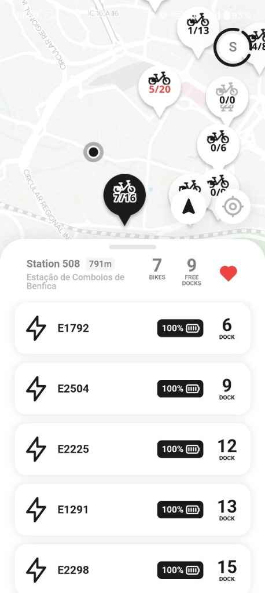
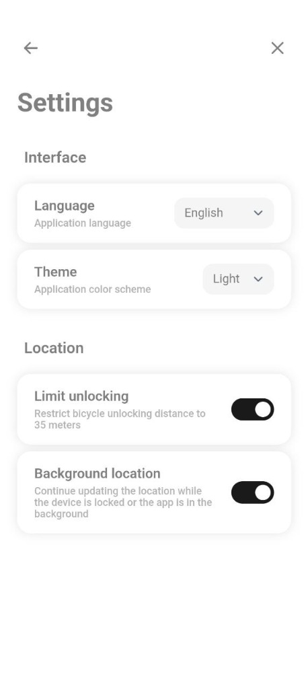
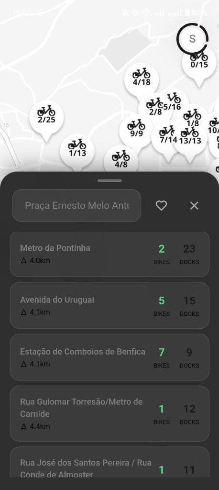
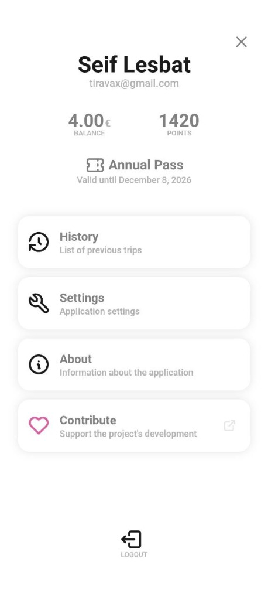
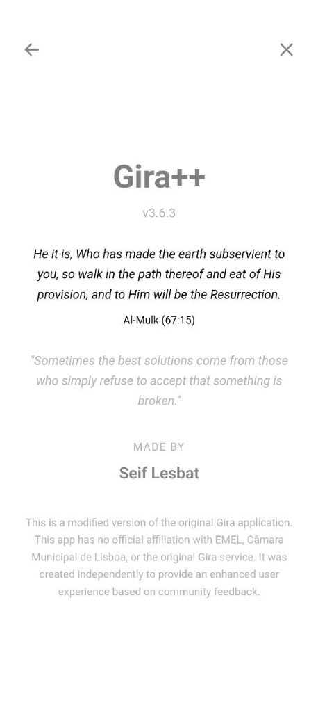

<div align="center">

# Gira++

### *The Definitive Lisbon Bike-Sharing Experience*

**Privacy-first. Blazing fast. Beautifully crafted.**

**[Visit Website](https://seiflesbat.github.io/gira-plus/) · [Download APK](../../releases/latest) · [FAQ](docs/FAQ.md)**

[](LICENSE)
[]()
[]()
[]()

<br>


&nbsp;&nbsp;&nbsp;

&nbsp;&nbsp;&nbsp;


</div>

---

## Overview

Gira++ is a complete reimagining of the Lisbon bike-sharing experience. Built from the ground up with a focus on privacy, performance, and user experience, it delivers everything the official app should be—without the tracking, bloat, or frustration.

This is not just another fork. It's a statement: software can be both powerful and respectful of its users.

---

## What's New in v3.6.3

### Destination Finder
Search any address in Lisbon and instantly see the nearest stations with available docks. The interface stays open while you explore the map, giving you complete freedom to pan, zoom, and check multiple stations before making your choice.

### Address History & Favorites
Your recent searches are saved automatically. Mark frequently visited locations with a tap and access them instantly on your next ride.

### Smart Station Labels
Every station bubble now displays real-time availability in a clear `bikes/docks` format. Favorite stations are highlighted in red for instant recognition.

### Refined Interface
A cleaner map view with no attribution clutter. Professional glassmorphism design throughout. Full Arabic translation including RTL support and a verse from Al-Mulk (67:15).

---

## Core Principles

### Privacy Without Compromise
Zero tracking. Zero analytics. Zero data collection. The app communicates only with the official EMEL/Gira API—nothing else touches the network.

### Performance That Respects Your Time
17 MB package. Instant station loading. Real-time WebSocket updates. No background processes draining your battery.

### Internationalization
Full translations in English, Portuguese, and Arabic (including RTL support). Every string, every corner of the interface.

---

## Screenshots

<div align="center">

| Map View | Station Details | Destination Finder |
|:--------:|:---------------:|:------------------:|
|  |  |  |

| Profile | Settings | About |
|:-------:|:--------:|:-----:|
|  |  |  |

</div>

---

## Features

**Interactive Map**
- Real-time station availability with bikes/docks display
- Favorite station highlighting in red
- Clean, distraction-free interface
- Smooth navigation and zoom

**Destination Finder**
- Address search with autocomplete
- Nearest stations with dock availability
- Click-to-view with map fly animation
- Search history and saved addresses

**Trip Management**
- One-tap bike unlock
- Smart 35m distance limiting
- Complete ride history
- Active trip notifications

**Customization**
- Light and dark themes
- 3 language options (EN, PT, AR)
- Background location toggle
- Minimal, focused settings

---

## Download

### Latest Release: v3.6.3

[**Download APK**](../../releases/latest)

Requirements: Android 7.0+ (API 24)

---

## Building from Source

```bash
git clone https://github.com/SeifLesbat/gira-plus.git
cd gira-plus

npm install
npm run build
npx cap sync android

cd android && ./gradlew assembleDebug
```

---

## Technology

| Component | Technology |
|-----------|------------|
| Framework | SvelteKit 5 |
| Native Bridge | Capacitor |
| Maps | MapLibre GL |
| Language | TypeScript |
| Build | Vite |

---

## Contributing

Contributions are welcome. Fork the repository, create a feature branch, and submit a pull request.

---

## Legal Notice

Gira++ is an independent, open-source project. It is not affiliated with, endorsed by, or connected to EMEL, Gira, or Câmara Municipal de Lisboa.

This software is provided as-is, without warranty of any kind. Users assume all responsibility for its use. The developers are not liable for any damages arising from the use of this application.

The app interacts with the official Gira/EMEL API. Service availability depends on third-party infrastructure outside our control.

---

## License

MIT License. See [LICENSE](LICENSE) for details.

---

<div align="center">

**Built for Lisbon cyclists who deserve better.**

*[Seif Lesbat](mailto:Algorise@usa.com)*

</div>