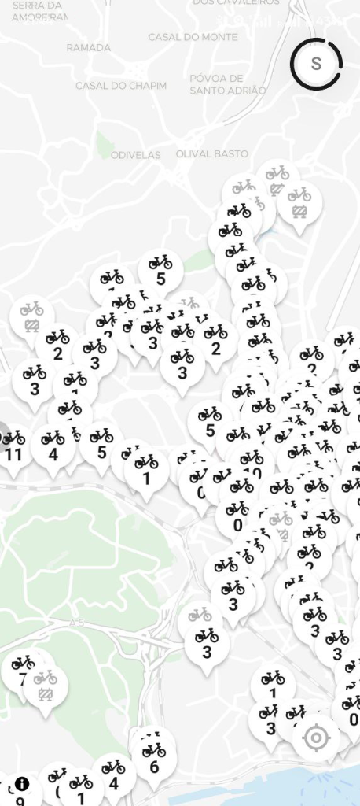
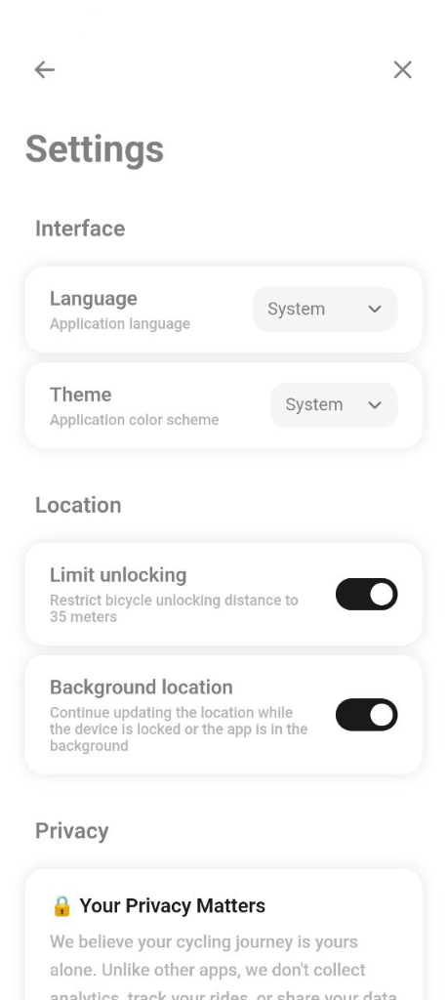
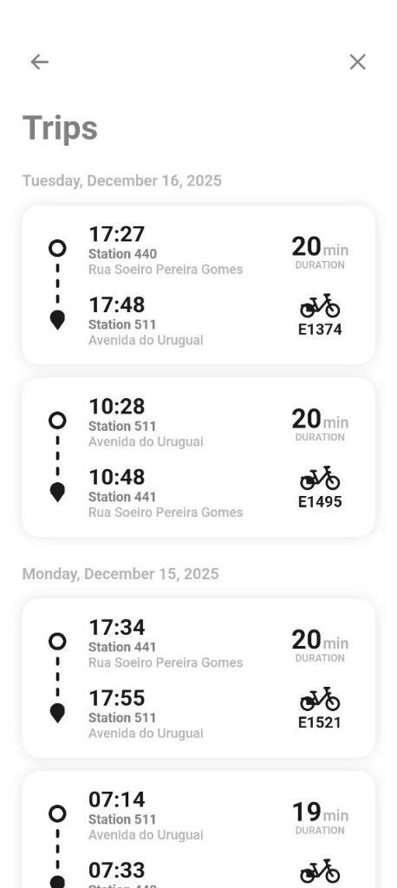
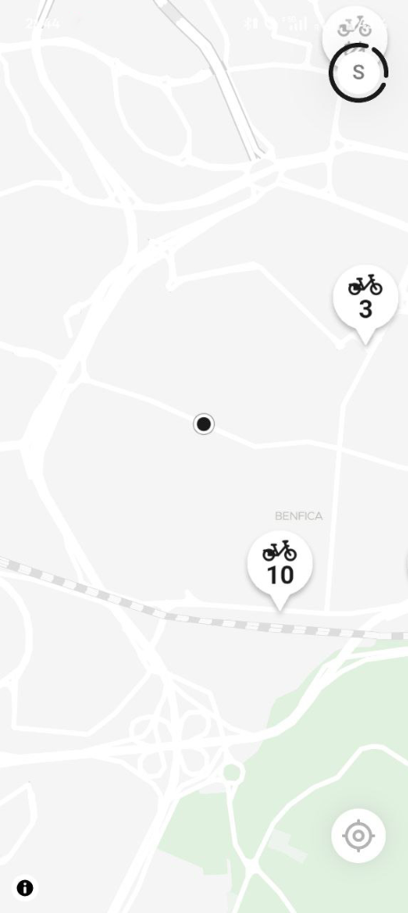
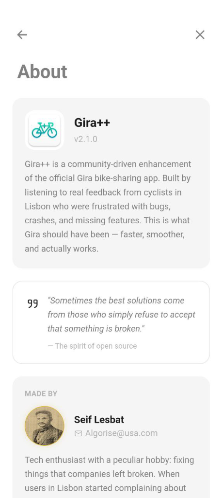

<div align="center">

# 🚴 Gira++

### *Lisbon Bike-Sharing, Reimagined*

**The privacy-focused, lightning-fast alternative to the official Gira app**

[](LICENSE)
[]()
[]()
[]()

<br>


&nbsp;&nbsp;&nbsp;

&nbsp;&nbsp;&nbsp;


</div>

---

## 🔒 Total Privacy — Zero Tracking

> *"Your cycling journey is yours alone."*

Unlike most apps, **Gira++ sends absolutely no data to third parties**. We don't track your rides, collect analytics, or share your information with anyone.

| Feature | Gira++ | Others |
|---------|:------:|:------:|
| No analytics tracking | ✅ | ❌ |
| No third-party servers | ✅ | ❌ |
| No device fingerprinting | ✅ | ❌ |
| No usage reports | ✅ | ❌ |
| Open source | ✅ | ❌ |

**The app only communicates with the official EMEL/Gira API** — nothing else.

---

## ⚡ Lightning Fast & Lightweight

Built with performance in mind:

- **17 MB** APK size — no bloat
- **Instant** station loading
- **Real-time** bike availability via WebSocket
- **Smooth** map navigation
- **Zero** unnecessary background processes

---

## 🌍 9 Languages Supported

Gira++ speaks your language:

| Language | Native Name |
|----------|-------------|
| 🇬🇧 English | English |
| 🇵🇹 Portuguese | Português |
| 🇪🇸 Spanish | Español |
| 🇫🇷 French | Français |
| 🇩🇪 German | Deutsch |
| 🇮🇹 Italian | Italiano |
| 🇸🇦 Arabic | العربية |
| 🇷🇺 Russian | Русский |
| 🇮🇳 Hindi | हिन्दी |

---

## ✨ Features

<table>
<tr>
<td width="50%">

### 🗺️ Interactive Map
- Real-time station availability
- Bike count at each station
- Your location tracking
- Clean, minimal design

</td>
<td width="50%">

### 🚲 Easy Bike Rental
- One-tap bike unlock
- Smart distance limiting
- Electric & classic bikes
- Seamless experience

</td>
</tr>
<tr>
<td width="50%">

### 📊 Trip History
- Complete ride records
- Duration & stations
- Bike identification
- Date organization

</td>
<td width="50%">

### ⚙️ Customizable
- Light/Dark themes
- Daylight auto-theme
- Language selection
- Privacy controls

</td>
</tr>
</table>

---

## 📱 Screenshots

<div align="center">

| Map View | Stations | About |
|:--------:|:--------:|:-----:|
|  |  |  |

| Settings | Trips |
|:--------:|:-----:|
|  |  |

</div>

---

## 📥 Download

### Latest Release: v2.4.0

[⬇️ **Download APK**](../../releases/latest)

> **Requirements:** Android 7.0+ (API 24)

---

## 🛠️ Building from Source

```bash
# Clone the repository
git clone https://github.com/YOUR_USERNAME/gira-plus.git
cd gira-plus

# Install dependencies
npm install

# Build the web app
npm run build

# Sync with Android
npx cap sync android

# Build APK
cd android && ./gradlew assembleDebug
```

---

## 🏗️ Tech Stack

| Technology | Purpose |
|------------|---------|
| **SvelteKit 5** | Frontend framework |
| **Capacitor** | Native Android bridge |
| **MapLibre GL** | Map rendering |
| **TypeScript** | Type-safe development |
| **Vite** | Build tooling |

---

## 🤝 Contributing

Contributions are welcome! Feel free to:

1. Fork the repository
2. Create a feature branch
3. Submit a pull request

---

## 📄 License

This project is licensed under the MIT License — see the [LICENSE](LICENSE) file for details.

---

## ⚠️ Legal Disclaimer

### No Affiliation
Gira++ is an **independent, open-source, community-driven project**. It is **NOT** affiliated with, endorsed by, sponsored by, or in any way officially connected to:
- **EMEL** (Empresa Municipal de Mobilidade e Estacionamento de Lisboa)
- **Gira** (the official bike-sharing service)
- **Câmara Municipal de Lisboa** (Lisbon City Council)
- Any of their subsidiaries, affiliates, or partners

All product names, logos, and brands mentioned are property of their respective owners.

### No Warranty
This software is provided **"AS IS"**, without warranty of any kind, express or implied, including but not limited to:
- Merchantability
- Fitness for a particular purpose
- Non-infringement
- Accuracy or reliability of information
- Continuous, uninterrupted, or error-free operation

### Limitation of Liability
**IN NO EVENT** shall the authors, contributors, or copyright holders be liable for:
- Any direct, indirect, incidental, special, exemplary, or consequential damages
- Loss of use, data, profits, or business interruption
- Any claims by third parties
- Any damages arising from the use or inability to use this software

This limitation applies regardless of the theory of liability (contract, tort, negligence, strict liability, or otherwise), even if advised of the possibility of such damages.

### Third-Party Services
This application interacts with the official Gira/EMEL API. The developers of Gira++:
- Have no control over the availability or functionality of external services
- Are not responsible for any changes, disruptions, or discontinuation of third-party APIs
- Cannot guarantee compatibility with future versions of external services

### User Responsibility
By using this application, you agree that:
- You use it entirely **at your own risk**
- You are responsible for compliance with all applicable laws and terms of service
- You will not hold the developers liable for any consequences of using this app
- You understand this is an unofficial application

### Intellectual Property
This project does not claim ownership of any trademarks, service marks, or logos of third parties. Any use of third-party intellectual property is for identification purposes only and does not imply endorsement.

### Governing Law
Any disputes arising from the use of this software shall be governed by applicable open-source software laws and the MIT License terms.

---

## 📄 License

This project is licensed under the MIT License — see the [LICENSE](LICENSE) file for details.

---

<div align="center">

**Made with ❤️ for Lisbon cyclists**

*By [Seif Lesbat](mailto:Algorise@usa.com)*

</div>